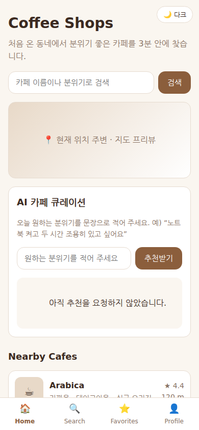
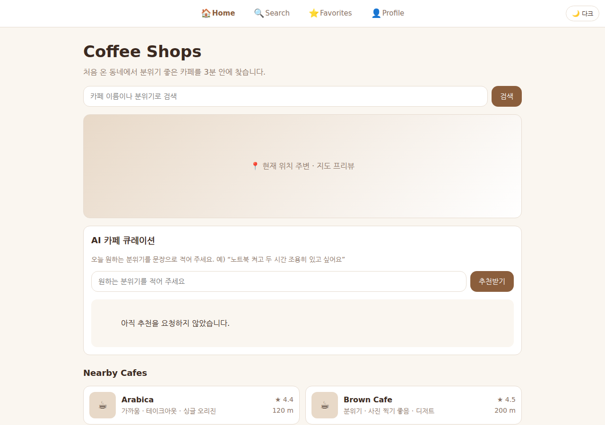
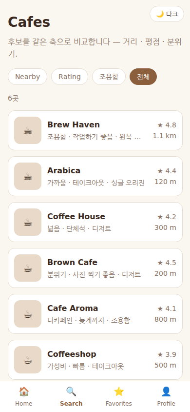
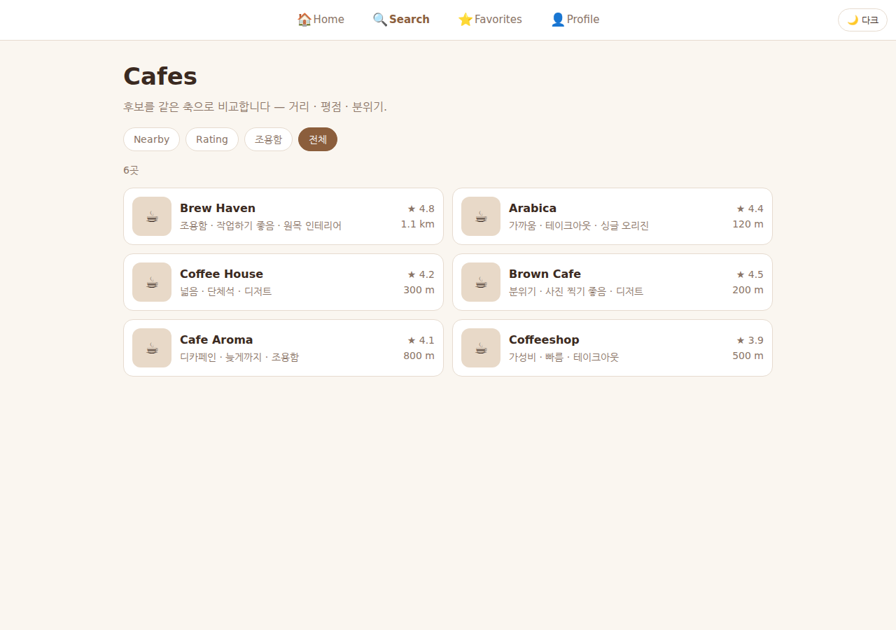
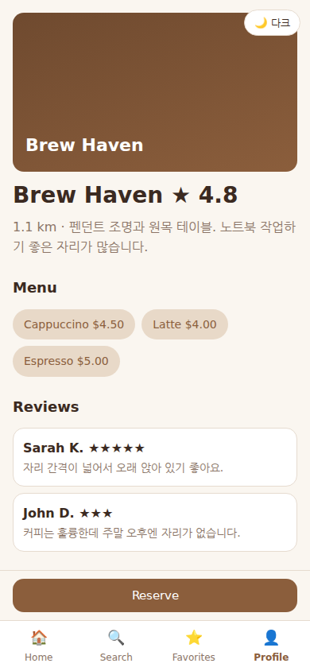
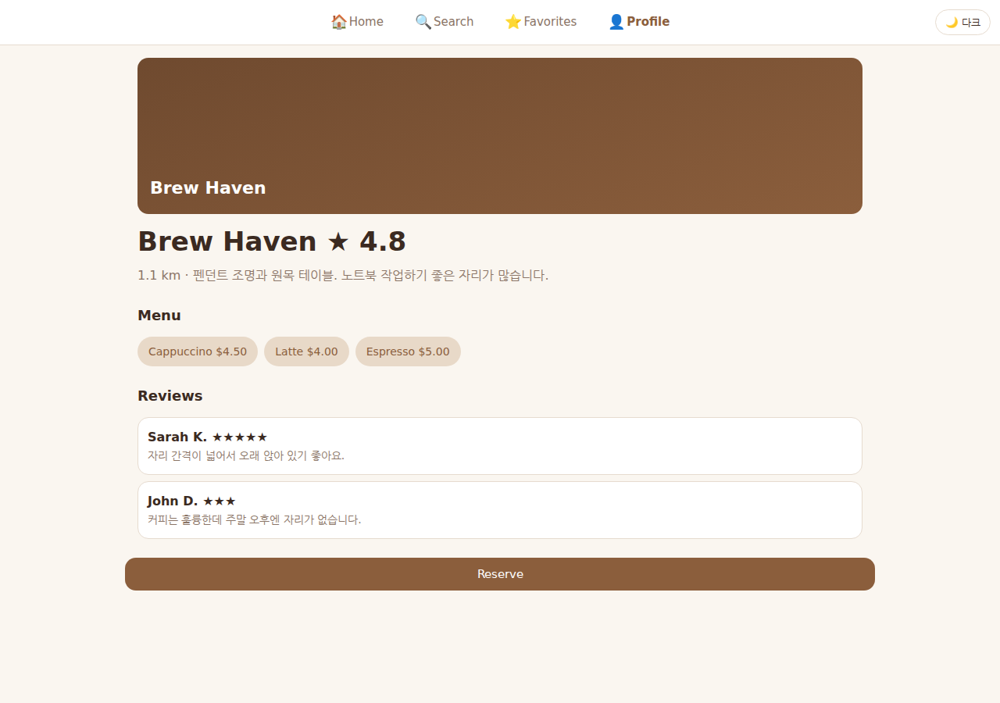
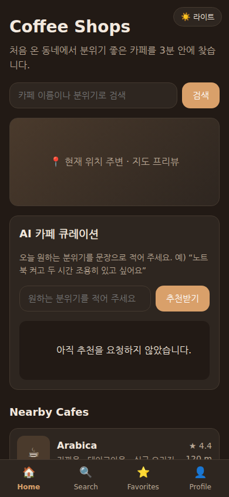

# BrewFinder — AI 카페 큐레이션 웹 서비스 (A1-3)

처음 온 동네에서 **분위기 좋은 카페를 3분 안에 찾아 예약**하는 웹 서비스입니다.
순수 HTML/CSS/JavaScript 로 만든 화면 3개와, Vercel Serverless Functions(Python) 로 만든
AI 추천 엔드포인트 하나로 이루어져 있습니다.

| 항목 | 값 |
|---|---|
| 프론트엔드 | 순수 HTML · CSS · JavaScript (프레임워크 없음) |
| 백엔드 | Vercel Serverless Functions — Python (`api/recommend.py`) |
| AI 기능 | 취향 문장 → 카페 큐레이션 (OpenAI Chat Completions) |
| 배포 | GitHub ↔ Vercel 연동 (아래 [배포](#배포--github--vercel) 참조) |
| 환경 변수 | `OPENAI_API_KEY` (서버 전용 — 브라우저에 내려가지 않음) |

---

## 이 미션의 위치 — 앞 미션에서 무엇을 이어받았나

| 앞 미션 | 이어받은 것 | 이 저장소의 어디에 |
|---|---|---|
| **B2-1** (UI/UX 시안) | 서비스 정체성(BrewFinder), 화면 3종(메인·목록·상세), warm brown 팔레트, 정보 구조 | `css/style.css` 변수, 페이지 3개 구조, `js/data.js` 카페 6곳 |
| **A1-2** (API 활용) | 외부 API 오류를 상태코드별로 나눠 안내하는 방식, 키를 환경변수로만 두는 3중 방어 | `api/recommend.py`, `js/app.js` 의 `httpMessage()` |

B2-1 은 **그림**이었고 A1-3 은 그 그림을 **동작하는 서비스**로 만드는 자리입니다.
시안의 "발견 → 비교 → 결정" 퍼널이 그대로 페이지 3개가 됩니다.

---

## 서비스 기획서

### 아이디어와 목적

낯선 동네에서 카페를 고를 때 지도 앱은 **결과가 너무 많고**, 후기 앱은 **읽는 데 오래 걸립니다.**
BrewFinder 는 "지금 내 기분"을 한 문장으로 받아 **한 곳을 골라 주는 것**을 목표로 합니다.

### 타겟 사용자

- 출장·여행으로 처음 온 동네에 있는 직장인
- 노트북 작업할 자리를 빨리 찾아야 하는 사람
- 후보를 오래 비교하기보다 **누가 하나 골라 주기를** 바라는 사람

### 페이지 설계 (3개) 와 이동 방식

| 단계 | 페이지 | 사용자 과업 | 이 화면이어야 하는 이유 |
|---|---|---|---|
| 발견 | `index.html` | "내 주변에 뭐가 있지?" | 검색·지도·추천 3곳으로 진입점을 좁게 연다 |
| 비교 | `list.html` | "이 중 어디가 낫지?" | 필터칩으로 후보를 압축하고 같은 축(거리·평점)으로 비교한다 |
| 결정 | `detail.html` | "여기로 정하고 예약" | 메뉴·리뷰로 확신을 주고 하단 고정 버튼으로 행동을 유도한다 |

이동은 **하단 4탭 네비게이션**(Home·Search·Favorites·Profile)과 카드 클릭으로 이루어집니다.
데스크톱에서는 같은 메뉴가 상단 가로 메뉴로 바뀝니다.

### AI 기능 정의 (1개)

| | 내용 |
|---|---|
| **입력** | 사용자가 쓴 취향 문장 1개 (예: "노트북 켜고 두 시간 조용히 있고 싶어요") + 현재 카페 목록 |
| **처리** | `POST /api/recommend` → OpenAI 에 "이 목록 안에서만 고르라"는 제약과 함께 질의 |
| **출력** | 추천 1곳 + 이유 2~3문장 + 차선책 1곳 |
| **사용자 가치** | 후기를 읽지 않고도 **한 곳으로 좁혀진다**. 비교 시간을 몇 분에서 몇 초로 줄인다 |

---

## 실행 방법

### 1) 화면만 보기 (AI 기능 제외)

정적 파일이라 서버 없이도 열립니다. 다만 `fetch('/api/...')` 는 동작하지 않습니다.

```bash
git clone https://github.com/dicia-jhoh/codyssey-a1-3.git
cd codyssey-a1-3
python3 -m http.server 8000
# 브라우저에서 http://localhost:8000 접속
```

### 2) AI 기능까지 (Vercel CLI)

`vercel dev` 는 `api/` 폴더를 실제 배포와 같은 방식으로 띄워 줍니다.

```bash
npm i -g vercel
cp .env.example .env.local     # 값을 실제 키로 채웁니다 (.gitignore 에 있어 커밋되지 않습니다)
vercel dev
```

### 3) 환경 변수

| 이름 | 어디에 설정하나 | 비고 |
|---|---|---|
| `OPENAI_API_KEY` | 로컬은 `.env.local`, 배포는 Vercel 프로젝트 Settings → Environment Variables | **서버에서만** 읽습니다. 브라우저 번들에 들어가지 않습니다 |
| `TRACK_WEBHOOK_URL` | 위와 같음 (선택) | 사용 이벤트를 외부 도구로 보낼 때만. 없으면 로그만 남깁니다 |

---

## 파일 구조

```text
codyssey-a1-3/
├── index.html          메인(발견) — 검색·지도 프리뷰·AI 큐레이션·주변 추천
├── list.html           목록(비교) — 필터칩·카페 카드
├── detail.html         상세(결정) — 히어로·메뉴·리뷰·예약
├── css/
│   └── style.css       변수 → 뼈대 → 컴포넌트 → 페이지 → 반응형 → 다크 모드
├── js/
│   ├── data.js         카페 데이터(B2-1 시안 계승)
│   └── app.js          렌더·검색·필터·fetch·오류 처리·테마
├── api/
│   ├── recommend.py    Vercel Serverless Function (POST /api/recommend) — AI 큐레이션
│   └── track.py        Vercel Serverless Function (POST /api/track) — 사용 이벤트 수집
├── images/             화면 스크린샷(모바일·데스크톱·다크) — 자동 캡처
├── requirements.txt    Python 런타임 선택 + 패키지 목록(현재 표준 라이브러리만)
├── vercel.json         함수 런타임·최대 실행 시간
├── .env.example        키 형식만 공유(값은 자리표시자)
└── .gitignore          .env · .vercel 제외
```

---

## 핵심 개념 설명

### HTML · CSS · JavaScript 의 역할

셋은 같은 화면을 **다른 축**으로 나눠 맡습니다.

| | 담당 | 이 프로젝트에서 |
|---|---|---|
| **HTML** | 무엇이 있는가 — 구조·의미 | 제목·폼·목록 자리. 계산이 없습니다 |
| **CSS** | 어떻게 보이는가 — 표현 | 색·간격·반응형·다크 모드. 동작이 없습니다 |
| **JavaScript** | 무엇이 일어나는가 — 동작 | 데이터를 카드로 바꾸고, 입력을 요청으로 바꾸고, 응답을 화면에 반영 |

나누면 **바꾸는 이유가 서로 섞이지 않습니다.** 색을 바꿀 때 로직을 건드릴 일이 없고,
추천 규칙을 바꿀 때 마크업을 건드릴 일이 없습니다.

역할이 겹치면 어떻게 되는지도 겪어 봤습니다 — 평점·거리를 HTML 에 직접 써 두면 카페가 늘 때마다
세 페이지를 고쳐야 합니다. 그래서 데이터는 `js/data.js` 한 곳에 두고 화면은 그것을 그립니다.

### 사용자 입력 → fetch → 화면 반영

이 서비스에서 가장 중요한 흐름입니다.

```text
[사용자] 취향 문장 입력 → 「추천받기」
   ↓  js/app.js  initAiCuration()
① 빈 값이면 여기서 막는다 (서버를 부르지 않는다)
② fetch('/api/recommend', {method:'POST', body: JSON})  ← 12초 타이머 시작
   ↓
[서버] api/recommend.py  handler.do_POST()
③ 입력을 다시 검증 → 환경변수에서 키를 읽음 → OpenAI 호출
   ↓
④ {"recommendation": "..."} 로 응답 (실패면 {"error": "..."} + 상태코드)
   ↓
⑤ app.js 가 응답을 읽어 화면의 .ai-output 에 문장을 넣는다
```

③ 단계에서 서버가 실제로 AI 를 부르는 코드입니다. 프롬프트에 **고를 수 있는 카페 목록**을 함께
넣어 목록 밖 추천을 막습니다 — 없는 가게를 지어내면 서비스가 거짓말을 하게 됩니다.

```python
def call_openai(api_key: str, prompt: str) -> str:
    """OpenAI Chat Completions 호출 → 답변 텍스트. 실패는 예외로 올린다."""
    body = json.dumps(
        {
            "model": MODEL,
            "messages": [{"role": "user", "content": prompt}],
            "temperature": 0.7,
            "max_tokens": 400,  # 응답 길이를 묶어 요금과 대기시간을 예측 가능하게 만든다
        }
    ).encode("utf-8")
    request = urllib.request.Request(
        OPENAI_URL,
        data=body,
        headers={"Authorization": f"Bearer {api_key}", "Content-Type": "application/json"},
        method="POST",
    )
    with urllib.request.urlopen(request, timeout=UPSTREAM_TIMEOUT) as response:
        payload = json.loads(response.read().decode("utf-8"))
    return payload["choices"][0]["message"]["content"].strip()
```

⑤ 단계에서 응답을 화면에 넣는 코드입니다. 성공과 실패가 **같은 함수**를 쓰되 `is-error`
클래스로만 갈립니다 — 표시 위치가 두 군데로 갈리면 "성공 문구 아래 실패 문구가 남는" 상태가
생깁니다.

```javascript
  const show = (message, isError) => {
    output.textContent = message;
    output.classList.toggle('is-error', Boolean(isError));
  };

  // …요청이 성공했을 때
      const data = await response.json();
      show(data.recommendation || '추천 문구가 비어 있습니다. 다시 시도해 주세요.');
      track('ai_success');
```

핵심은 **브라우저가 AI API 를 직접 부르지 않는다**는 점입니다. 우리 서버(`/api/recommend`)를
부르고, 서버가 대신 AI 를 부릅니다. 이유는 아래 보안 절에 적었습니다.

### Vercel Serverless Functions 란

**서버를 띄워 두지 않고 함수만 올려 두는 방식**입니다. 요청이 오면 그때 함수가 실행되고,
끝나면 사라집니다. 우리가 관리할 서버·포트·프로세스가 없습니다.

| | 전통적인 서버 | Serverless Function |
|---|---|---|
| 실행 | 항상 떠 있음 | 요청이 올 때만 실행 |
| 비용 | 놀아도 과금 | 호출한 만큼 |
| 상태 | 메모리에 유지 가능 | **호출 간 유지되지 않음** |
| 이 프로젝트 | 해당 없음 | `api/recommend.py` 하나 |

Vercel 의 규칙은 두 가지입니다. ① `api/` 폴더의 파일 하나가 엔드포인트 하나가 된다
(`api/recommend.py` → `/api/recommend`) ② Python 은 `handler` 라는 이름의
`BaseHTTPRequestHandler` 클래스를 진입점으로 찾는다.

```python
class handler(BaseHTTPRequestHandler):  # noqa: N801 — Vercel 이 이 이름을 찾는다
    """POST /api/recommend — 본문 {"wish": "...", "cafes": [...]}"""

    def do_POST(self) -> None:
```

"상태가 유지되지 않는다"는 성질 때문에 **함수 안에 캐시나 세션을 두지 않았습니다.** 다음 요청은
다른 인스턴스에서 실행될 수 있어 저장해도 사라집니다. 저장이 필요해지면 외부 저장소
(KV·DB)를 붙이는 것이 정석이고, 그 자리는 `do_POST` 의 응답 직전입니다.

### 환경 변수로 API 키를 관리해야 하는 이유

**브라우저 코드는 전부 공개됩니다.** 개발자 도구를 열면 JavaScript 원문이 그대로 보이고,
네트워크 탭에는 요청 헤더까지 남습니다. 프론트에서 AI API 를 직접 부르면 키가 그 자리에 노출되고,
키를 본 사람은 누구나 **내 계정으로** 호출할 수 있습니다. 요금은 나에게 청구됩니다.

이 프로젝트의 3중 방어입니다.

| 층 | 무엇을 | 코드/파일 |
|---|---|---|
| 1 | 키를 **서버에서만** 읽는다 | `api/recommend.py` 의 `os.environ.get(KEY_NAME)` |
| 2 | 코드에는 **이름만** 둔다 | `KEY_NAME = "OPENAI_API_KEY"` — 값은 어디에도 없다 |
| 3 | `.env` 를 커밋에서 제외한다 | `.gitignore` 첫 줄. 형식은 `.env.example` 로만 공유 |

```python
        api_key = os.environ.get(KEY_NAME, "").strip()
        if not api_key:
            # 키 미설정은 사용자 잘못이 아니다 — 서버 설정 문제로 알린다
            self._send(500, {"error": f"서버에 {KEY_NAME} 환경변수가 설정되지 않았습니다."})
            return
```

**키가 유출됐다면** 코드에서 지우는 것으로 부족합니다(git 이력에 남습니다). 순서는
① 제공자 콘솔에서 **즉시 폐기·재발급** ② 새 키를 환경변수에 설정 ③ 노출된 커밋 이력 정리
(`git filter-repo` 등) ④ 사용량·청구 내역 확인. ①이 가장 급합니다 — 이력 정리에 시간을 쓰는
동안에도 옛 키는 살아 있습니다.

### 로컬 환경과 배포 환경의 차이

| | 로컬 | 배포(Vercel) |
|---|---|---|
| 정적 파일 | `python3 -m http.server` 로도 열림 | Vercel CDN |
| `api/` 함수 | `vercel dev` 가 있어야 동작 | 자동으로 엔드포인트가 됨 |
| 환경 변수 | `.env.local` 파일 | 프로젝트 Settings 에 등록 |
| 주소 | `http://localhost:3000` | `https://<프로젝트>.vercel.app` |

가장 자주 걸리는 차이는 **환경 변수를 로컬에만 넣고 배포에는 안 넣는 것**입니다.
로컬에서 잘 되던 AI 기능이 배포 후 500 을 뱉으면 여기부터 확인합니다.

---

## 실패 처리 — 세 가지 모두 사용자에게 안내한다

미션 요구는 "1개 이상"이지만 셋 다 넣었습니다. 사용자가 **할 일이 서로 다르기** 때문입니다.

| 실패 | 사용자가 보는 문장 | 사용자가 할 일 |
|---|---|---|
| 빈 입력 | "원하는 분위기를 한 문장이라도 적어 주세요…" | 입력한다 |
| API 오류 4xx/5xx | 상태코드별 안내(아래) | 기다리거나 문의한다 |
| 지연·타임아웃 | "응답이 12초를 넘겨 요청을 취소했습니다…" | 잠시 후 재시도한다 |

빈 입력은 **서버를 부르기 전에** 막습니다 — 부를 이유가 없는 요청으로 쿼터와 요금을 쓰지
않기 위해서입니다.

```javascript
    // ① 빈 입력
    if (!wish) {
      show('원하는 분위기를 한 문장이라도 적어 주세요. 예) 조용히 작업할 곳', true);
      input.focus();
      return;
    }
```

타임아웃은 `AbortController` 로 요청 자체를 끊습니다. 끊지 않으면 응답이 30초 뒤에 도착해
사용자가 이미 다른 걸 하고 있는데 화면이 갑자기 바뀝니다.

```javascript
    const controller = new AbortController();
    const timer = setTimeout(() => controller.abort(), REQUEST_TIMEOUT_MS);

    try {
      const response = await fetch('/api/recommend', {
        method: 'POST',
        headers: { 'Content-Type': 'application/json' },
        body: JSON.stringify({ wish, cafes: CAFES.map(toBrief) }),
        signal: controller.signal,
      });
```

상태코드는 **원인이 다르면 안내도 달라야** 합니다. 429 에 "관리자에게 문의"라고 쓰면 사용자는
할 수 있는 일(30초 기다리기)을 못 합니다.

```javascript
function httpMessage(status) {
  if (status === 400) return '입력을 이해하지 못했습니다. 문장을 조금 더 구체적으로 적어 주세요.';
  if (status === 401 || status === 403) {
    return '서버의 AI 키 설정에 문제가 있습니다. 관리자에게 문의해 주세요.';
  }
  if (status === 429) return '요청이 몰리고 있습니다. 30초쯤 뒤에 다시 시도해 주세요.';
  if (status >= 500) return '서버에 일시적인 문제가 있습니다. 잠시 후 다시 시도해 주세요.';
  return `요청이 실패했습니다 (HTTP ${status}). 잠시 후 다시 시도해 주세요.`;
}
```

`finally` 에서 타이머를 정리하고 버튼을 되살립니다 — 성공·실패 어느 쪽으로 끝나도
버튼이 비활성인 채 남으면 사용자는 다시 시도할 수 없습니다.

---

## 화면 스크린샷

`images/` 에 실제 렌더링 결과를 넣어 두었습니다. 손으로 찍은 것이 아니라 headless 브라우저로
두 폭에서 자동 캡처한 것이라, 코드를 고치면 같은 방법으로 다시 뽑을 수 있습니다.

| 화면 | 모바일 390×844 | 데스크톱 1280×900 |
|---|---|---|
| 메인(발견) |  |  |
| 목록(비교) |  |  |
| 상세(결정) |  |  |

다크 모드(보너스): 

**캡처가 실제로 버그를 잡았습니다.** 첫 촬영에서 데스크톱 화면의 가로 메뉴가 콘텐츠
**아래**에 있었습니다 — `<nav>` 를 문서 끝에 두었기 때문에 `position: static` 이 되는 순간
아래로 내려간 것입니다. 모바일에서는 `position: fixed` 라 위치가 드러나지 않아 눈치채지
못했습니다. `<nav>` 를 `<main>` 앞으로 옮겨 고쳤습니다(고정 배치는 문서 순서와 무관하므로
모바일 화면은 그대로입니다).

---

## 반응형 — 두 가지 화면 크기에서 확인

| 폭 | 무엇이 달라지나 |
|---|---|
| ~699px (모바일) | 카드 1열, 하단 고정 4탭 네비, 예약 버튼 하단 고정 |
| 700~999px (태블릿) | 카드 **2열**, 타이틀·지도 프리뷰 확대 |
| 1000px~ (데스크톱) | 탭바가 **상단 가로 메뉴**로, 하단 고정 해제 |

```css
@media (min-width: 700px) {
  .card-list {
    grid-template-columns: 1fr 1fr;
  }
}

@media (min-width: 1000px) {
  .tabbar {
    position: static;
    height: auto;
    border-top: 0;
    border-bottom: 1px solid var(--border);
    justify-content: center;
    gap: 24px;
  }
}
```

데스크톱에서 하단 고정 네비를 푼 이유: 하단 고정은 **엄지로 닿는 거리**를 위한 배치입니다.
마우스를 쓰는 화면에서는 세로 공간만 차지합니다.

`<meta name="viewport">` 가 반응형의 출발점입니다. 이 한 줄이 없으면 모바일 브라우저가
데스크톱 폭으로 그린 뒤 통째로 축소해, 미디어 쿼리를 아무리 써도 글자만 작아집니다.

```html
    <meta name="viewport" content="width=device-width, initial-scale=1.0" />
```

---

## 실행 결과 (실측 로그)

`api/recommend.py` 의 `handler` 를 로컬에 띄워 다섯 경로를 확인했습니다.
(키를 설정하지 않은 환경이라 정상 요청은 500 안내로 끝납니다 — 이 또한 의도한 경로입니다.)

```text
== GET (배포 확인용) ==
{"status": "ok", "usage": "POST /api/recommend {wish, cafes}"}

== POST 빈 입력 ==
{"error": "원하는 분위기를 한 문장 이상 적어 주세요."} [HTTP 400]

== POST 목록 없음 ==
{"error": "추천 대상 카페 목록이 비어 있습니다."} [HTTP 400]

== POST 정상 요청(키 미설정 환경) ==
{"error": "서버에 OPENAI_API_KEY 환경변수가 설정되지 않았습니다."} [HTTP 500]

== POST 깨진 JSON ==
{"error": "요청 본문이 올바른 JSON 이 아닙니다."} [HTTP 400]
```

읽는 법: 400 은 **요청을 고치면 되는** 문제(사용자·프론트), 500 은 **서버 설정** 문제입니다.
경계를 이렇게 나눠야 화면의 안내 문구가 "무엇을 하라"로 정확해집니다.

수집 엔드포인트(`api/track.py`)도 같은 방식으로 확인했습니다.

```text
== GET 수집 설정 상태 ==
{"status": "ok", "webhook": false, "events": ["ai_error", "ai_request", "ai_success",
 "cafe_open", "page_view", "reserve_click", "theme_toggle"]}

== POST 정상 이벤트 ==
{"track": {"event": "ai_request", "path": "/index.html", "detail": {"length": 18}}}   ← 서버 로그
{"ok": true, "forward": "skipped(no-webhook)"} [HTTP 200]

== POST 허용목록 밖(오타) ==
{"error": "알 수 없는 이벤트: ai_requst"} [HTTP 400]
```

세 번째 줄이 허용 목록의 값어치입니다 — `ai_requst` 라는 오타가 조용히 새 지표로 쌓이지
않고 그 자리에서 거부됩니다.

반응형 확인도 자동화했습니다. 두 폭에서 세 페이지를 열어 캡처한 결과입니다.

```text
01_main_mobile.png    390x844
02_list_mobile.png    390x844
03_detail_mobile.png  390x844
04_dark_mobile.png    390x844 (dark)
01_main_desktop.png   1280x900
02_list_desktop.png   1280x900
03_detail_desktop.png 1280x900
```

---

## 배포 — GitHub ↔ Vercel

절차는 다음과 같습니다.

1. Vercel 에 GitHub 계정으로 로그인 → **Add New Project** → 이 저장소 선택
2. Framework Preset = **Other** (프레임워크를 쓰지 않습니다)
3. **Settings → Environment Variables** 에 `OPENAI_API_KEY` 등록 (Production·Preview 모두)
4. **Deploy** → 발급된 `https://<프로젝트>.vercel.app` 로 접속
5. `main` 에 push 할 때마다 자동 재배포

> ⚠ **실제 연동 시 이 자리**에 배포 URL 이 들어갑니다. 이 저장소는 학습용 예시 답안이라
> Vercel 프로젝트를 연결하지 않았습니다 — 위 절차대로 연결하면
> `https://<프로젝트>.vercel.app` 이 발급되고, 아래 배포 확인 항목을 그대로 점검할 수 있습니다.
> OpenAI 키도 마찬가지로 **실제 연동 시 이 자리**(Vercel 환경 변수)에 값을 넣습니다.

### 배포 후 확인할 것

| 항목 | 확인 방법 |
|---|---|
| 네비게이션 | 하단 4탭으로 3페이지를 오갈 수 있는가 |
| 반응형 | 브라우저 폭을 줄여 카드가 2열 → 1열로 바뀌는가 |
| AI 기능 | 취향 문장을 넣어 추천 문장이 나오는가 |
| 엔드포인트 | `https://<프로젝트>.vercel.app/api/recommend` 를 브라우저로 열어 `{"status":"ok"}` 가 보이는가 |
| 키 노출 | 개발자 도구 → Sources 에서 키 문자열이 **검색되지 않는가** |

### 문제가 생기면 — 수정 후 재배포

| 증상 | 원인 | 조치 |
|---|---|---|
| AI 기능만 500 | 환경 변수 미등록 | Settings 에 키 등록 후 **Redeploy**(변수는 재배포해야 반영됨) |
| `/api/recommend` 404 | 파일 위치·이름 | `api/` 폴더 안에 있는지, 클래스 이름이 `handler` 인지 |
| 화면은 뜨는데 CSS 없음 | 경로 대소문자 | Vercel 은 대소문자를 구분합니다(`css/Style.css` ≠ `css/style.css`) |
| 로컬은 되는데 배포는 안 됨 | 환경 차이 | 위 로컬 vs 배포 표부터 확인 |

수정 → 커밋 → push 하면 Vercel 이 자동으로 다시 빌드합니다. 롤백은 Deployments 목록에서
이전 배포를 **Promote to Production** 하면 됩니다.

---

## AI 코딩 도구 사용 기록

| 무엇을 | 어떻게 요청했나 | 무엇을 고쳤나 |
|---|---|---|
| 카드 목록 렌더 | "카페 배열을 카드 목록으로 그리는 함수" | 생성된 코드가 `innerHTML` 에 데이터를 끼워 넣어 **XSS 여지**가 있었다. `textContent` + `createElement` 로 바꿨다 |
| fetch 호출 | "fetch 로 POST 하고 결과를 화면에 표시" | 타임아웃이 없었다. `AbortController` 와 `finally` 정리를 추가했다 |
| Vercel Python 함수 | "Vercel Python serverless 예제" | 클래스 이름이 `Handler` 로 생성돼 **404** 가 났다. Vercel 규약은 소문자 `handler` 다 |
| 다크 모드 | "다크 모드 토글" | 색을 규칙마다 다시 선언해 CSS 가 두 배가 됐다. 변수만 갈아 끼우는 방식으로 바꿨다 |

**오류를 스스로 설명할 수 있어야 하는 이유**를 여기서 겪었습니다. 세 번째 항목(`Handler` →
`handler`)은 도구가 만든 코드가 문법적으로 완벽했기 때문에 에러 메시지가 없었고, 404 만 떴습니다.
"Vercel 이 진입점을 이름으로 찾는다"는 구조를 모르면 검색어조차 만들 수 없습니다.

---

## 제약 조건 준수

| 제약 | 어떻게 지켰나 |
|---|---|
| 프론트엔드는 순수 HTML/CSS/JS | 프레임워크·번들러·CDN 스크립트 0개. `js/` 는 파일 2개 |
| 백엔드는 Vercel Serverless Functions(Python) | `api/recommend.py` — 표준 라이브러리만 사용 |
| AI 기능 1개 이상 | 취향 문장 → 카페 큐레이션 |
| 페이지/섹션 3개 이상 | 메인·목록·상세 |
| 실패 안내 1개 이상 | 빈 입력·API 오류·타임아웃 **3개 모두** |
| 키를 코드/README/스크린샷에 노출 금지 | 코드에는 이름만, README 에는 `YOUR_KEY` 자리표시자만 |
| 과금·쿼터 고려 | 빈 입력 사전 차단, `max_tokens` 400 제한, 입력 200자 제한, 12초 타임아웃 |
| 템플릿 그대로 복제 금지 | B2-1 에서 직접 만든 시안·데이터·문구를 기반으로 구성 |

---

## 보너스 (수행)

### 1. 다크 모드 + 선택 유지

CSS 변수만 갈아 끼우는 방식이라 규칙을 두 번 쓰지 않습니다.

```css
body.dark {
  --bg: #221a15;
  --surface: #2e2620;
  --text: #f3e9df;
  --brand: #d9a06a;
}
```

선택을 `localStorage` 에 남깁니다 — 저장하지 않으면 링크를 누를 때마다 밝은 화면으로 돌아가
눈이 부십니다.

```javascript
  button.addEventListener('click', () => {
    const next = !document.body.classList.contains('dark');
    localStorage.setItem('brewfinder-theme', next ? 'dark' : 'light');
    apply(next);
  });
```

### 2. 사용 이벤트 수집 + 외부 도구 연동 (`api/track.py`)

기능을 넣는 것과 **그 기능이 쓰이는지 아는 것**은 별개입니다. 두 번째 엔드포인트를 만들어
행동을 기록합니다.

| 알고 싶은 것 | 어떻게 재나 | 필요한 이벤트 |
|---|---|---|
| 다크 모드를 쓰는 사람 비율 | 토글 수 ÷ 방문 수 | `theme_toggle` ÷ `page_view` |
| AI 추천이 실제로 쓰이는가 | 요청 수 ÷ 방문 수 | `ai_request` ÷ `page_view` |
| 추천이 **도움이 됐는가** | 추천 성공 뒤 상세 진입·예약 비율 | `cafe_open`·`reserve_click` ÷ `ai_success` |
| 어떤 실패가 잦은가 | 사유별 집계 | `ai_error` 의 `reason`(`empty_input`·`timeout`·`http_429`…) |

세 번째 줄이 핵심입니다. "AI 기능을 몇 번 눌렀나"는 **호기심**을 재고, "추천받은 곳으로
들어갔나"는 **유용함**을 잽니다.

**입력 → 처리 → 저장/알림** 흐름은 이렇게 이어집니다.

```text
[사용자 행동]  다크 토글 · 추천 요청 · 카드 클릭 · 예약
   ↓  js/app.js  track(event, detail)      기다리지 않는다(await 없음)
[서버]  api/track.py  handler.do_POST()
   ├─ 허용 목록 검사 — 오타가 새 지표를 만들지 못하게 한다
   ├─ ① 구조화 로그 한 줄(JSON) → Vercel 함수 로그가 곧 조회 가능한 저장소
   └─ ② TRACK_WEBHOOK_URL 이 있으면 같은 이벤트를 외부 도구로 전달
        (Slack · Make/Zapier 같은 노코드 자동화 · 시트 적재 — URL 만 바꾸면 붙는다)
```

이벤트 이름을 **허용 목록으로 묶은** 이유: 아무 문자열이나 받으면 오타 하나가 새 지표를
만들고, 나중에 같은 행동이 두 이름으로 갈려 집계가 틀립니다.

```python
ALLOWED_EVENTS = {
    "page_view", "theme_toggle", "ai_request", "ai_success",
    "ai_error", "cafe_open", "reserve_click",
}
```

수집이 **서비스를 망가뜨리지 않게** 두 겹으로 막았습니다. 프론트는 `await` 하지 않고 실패를
삼키며, 서버는 웹훅이 죽어도 200 을 돌려줍니다(사유는 로그에 남깁니다).

```python
    try:
        with urllib.request.urlopen(request, timeout=WEBHOOK_TIMEOUT) as response:
            return f"forwarded({response.status})"
    except (urllib.error.HTTPError, urllib.error.URLError, TimeoutError) as exc:
        # 수집 실패가 서비스 실패가 되면 안 된다 — 사유만 남기고 넘어간다
        return f"forward-failed({exc})"
```

**개인정보는 보내지 않습니다.** 사용자가 쓴 취향 문장은 추천에는 쓰지만 기록에는 남기지
않고, 대신 **길이만** 보냅니다(문장이 짧아서 추천이 부실한지 볼 수 있으면 충분합니다).

```javascript
    track('ai_request', { length: wish.length }); // 문장 자체가 아니라 길이만 남긴다
```

> `TRACK_WEBHOOK_URL` 은 **실제 연동 시 이 자리**에 넣습니다. 값이 없으면 로그만 남기고
> 웹훅 단계는 건너뜁니다(`"forward": "skipped(no-webhook)"`).

---

## What-if — 조건이 바뀌면 무엇을 어떻게 바꾸나

### Q1. AI 기능을 여러 개로 늘린다면 구조를 어떻게 바꾸나

지금은 엔드포인트 하나(`/api/recommend`)에 프롬프트가 하나입니다. "리뷰 요약", "일정 추천",
"메뉴 번역" 이 붙는다고 가정하면 세 갈래가 있고, **개수에 따라 답이 다릅니다.**

| 방식 | 어떻게 | 언제 맞나 | 대가 |
|---|---|---|---|
| A. 파일 분리 | `api/summarize.py`·`api/plan.py` … 기능마다 파일 하나 | 기능 2~5개 | 프롬프트·호출·오류 처리가 파일마다 복제된다 |
| B. 공통 모듈 + 파일 분리 | 위 + `api/_llm.py` 에 `call_openai`·오류 매핑을 모은다 | 기능 3개 이상 | 없음 — 사실상 A 의 상위 호환 |
| C. 단일 엔드포인트 + 타입 파라미터 | `/api/ai` 하나가 `{"task": "summarize"}` 로 분기 | 기능이 많고 서로 매우 비슷할 때 | 한 함수가 커지고, 한 기능의 배포 실패가 전부를 막는다 |

**B 를 택하겠습니다.** 지금 코드에서 재사용 대상이 이미 드러나 있습니다 — `call_openai`,
`_send`, 상태코드 매핑은 기능이 늘어도 똑같습니다. 반면 프롬프트와 입력 검증은 기능마다
다르므로 각 파일에 남깁니다. 옮길 범위는 명확합니다.

```text
api/
├── _llm.py         call_openai() · UPSTREAM_TIMEOUT · KEY_NAME   (공통)
├── _http.py        send_json() · 상태코드 → 메시지               (공통)
├── recommend.py    build_prompt() + 입력 검증 + handler          (기능별)
└── summarize.py    build_prompt() + 입력 검증 + handler          (기능별)
```

프론트도 같은 방향입니다. `initAiCuration()` 이 엔드포인트 이름을 인자로 받게 하면
(`initAiPanel('/api/summarize', …)`) 타임아웃·오류 안내·이벤트 수집이 한 번만 존재합니다.

**공통으로 묶지 않을 것**도 정해 둡니다. 프롬프트는 절대 한 파일에 모으지 않습니다 —
기능마다 다른 이유로 바뀌는데 한 곳에 있으면 A 를 고치다 B 를 깨뜨립니다.

### Q2. 프론트엔드 프레임워크(React·Vue)를 써도 된다면

이 미션은 순수 HTML/CSS/JS 가 제약이지만, 제약이 풀린다면 판단은 이렇습니다.

| | 지금(순수 JS) | React/Vue 도입 시 |
|---|---|---|
| 상태 관리 | 직접 — `renderCards()` 를 다시 부른다 | 자동 — 상태가 바뀌면 화면이 따라온다 |
| 페이지 이동 | 파일 3개, 전체 새로고침 | 라우터, 부분 갱신(SPA) |
| 코드 재사용 | 함수 단위 | 컴포넌트 단위(카드·칩·패널) |
| 첫 로딩 | 파일 몇 개, 수십 KB | 번들 수백 KB(+ 빌드) |
| 학습·인수인계 | 브라우저 표준만 알면 됨 | 프레임워크 지식 필요 |
| 빌드 | 없음 — 파일을 그대로 올린다 | 필수(Vite 등) |

**이 규모에서는 지금이 낫습니다.** 화면 3개·상태 두 개(필터·테마)라 프레임워크가 해결해 줄
문제가 아직 생기지 않았습니다. 반대로 도입이 정당해지는 신호는 분명합니다 — ① 카드·칩 같은
조각이 5개 이상 재사용될 때 ② 서버 상태(로그인·즐겨찾기)가 여러 화면에 걸칠 때
③ `renderCards()` 를 언제 다시 불러야 하는지 추적하기 어려워질 때.

**바꿔야 할 범위**는 프론트에 한정됩니다.

| 바뀌는 것 | 그대로인 것 |
|---|---|
| HTML 3개 → 컴포넌트 + 라우터 | `api/recommend.py`·`api/track.py` (그대로) |
| `renderCards`/`renderDetail` → 컴포넌트 | `fetch('/api/…')` 계약(요청·응답 형식) |
| CSS → CSS Modules 등(선택) | 색 변수·반응형 규칙 |
| 빌드 설정 추가 | Vercel 배포 방식(프리셋만 바꿈) |

**백엔드가 전혀 안 바뀌는 것**이 핵심입니다. 프론트와 서버를 JSON 계약으로 갈라 두었기
때문입니다 — 이 경계가 없으면 프레임워크 교체가 전면 재작성이 됩니다.

### Q3. 지금 구조에서 다음에 손볼 개선 세 가지

우선순위는 **사용자가 체감하는 순서**입니다.

| 순위 | 개선 | 왜 먼저인가 | 어디를 고치나 |
|---|---|---|---|
| 1 | AI 응답 캐싱 | 같은 취향 문장이 반복 호출되면 요금만 나간다 | `api/recommend.py` — 입력 해시를 키로 외부 KV 저장 |
| 2 | 추천 결과에서 카드로 바로 이동 | 지금은 문장만 나와 사용자가 이름을 다시 찾아야 한다 | `initAiCuration()` — 응답에 `id` 를 함께 받아 링크 생성 |
| 3 | 즐겨찾기 저장 | 탭에 `Favorites` 가 있는데 실제 기능이 없다 | `js/app.js` + `localStorage`, 이후 서버 저장으로 승격 |

2번이 **측정과 직결**됩니다 — `ai_success` 뒤 `cafe_open` 비율이 곧 "추천이 유용했는가"인데,
지금은 사용자가 이름을 손으로 찾아야 해서 그 수치가 실제보다 낮게 나옵니다.

---

## 준비물 (전제 지식 0)

| 확인 항목 | 없으면 |
|---|---|
| 최신 브라우저 | Chrome·Edge·Safari 어느 것이든 됩니다 |
| Python 3.10 이상 | [python.org](https://www.python.org/downloads/) — 화면만 볼 때도 간이 서버로 씁니다 |
| Git | [git-scm.com](https://git-scm.com/) |
| Node.js (선택) | AI 기능까지 로컬에서 볼 때만 필요합니다(`vercel` CLI 설치용) |
| OpenAI API 키 (선택) | AI 기능을 실제로 호출할 때만 필요합니다 |

---

## 용어 사전

| 용어 | 뜻 |
|---|---|
| **정적 파일** | 서버가 계산 없이 그대로 내려 주는 파일(HTML·CSS·이미지) |
| **Serverless Function** | 요청이 올 때만 실행되고 끝나면 사라지는 함수. 서버를 관리하지 않는다 |
| **엔드포인트** | 요청을 받는 주소 하나. 여기서는 `/api/recommend` |
| **fetch** | JavaScript 가 서버에 요청을 보내는 함수 |
| **환경 변수** | 코드 밖(운영체제·배포 설정)에 두는 값. 키처럼 공개하면 안 되는 것을 담는다 |
| **미디어 쿼리** | "화면 폭이 N 이상일 때"처럼 조건을 걸어 CSS 를 다르게 적용하는 문법 |
| **AbortController** | 진행 중인 요청을 중간에 취소하는 도구 |
| **상태코드** | 요청 결과를 나타내는 숫자. 2xx 성공, 4xx 요청 문제, 5xx 서버 문제 |
| **XSS** | 데이터에 섞인 스크립트가 실행되는 취약점. `textContent` 로 넣으면 막힌다 |

---

## 따라 하기

처음부터 같은 결과를 만드는 순서입니다.

1. **저장소를 내려받습니다.**
   ```bash
   git clone https://github.com/dicia-jhoh/codyssey-a1-3.git
   cd codyssey-a1-3
   ```
2. **화면부터 확인합니다.** 간이 서버를 띄우고 브라우저로 엽니다.
   ```bash
   python3 -m http.server 8000
   ```
   `http://localhost:8000` 접속 → 하단 탭으로 3페이지를 오가 봅니다.
3. **폭을 줄여 봅니다.** 브라우저 창을 좁히면 카드가 2열 → 1열로 바뀝니다.
4. **다크 모드를 눌러 봅니다.** 우측 상단 버튼. 페이지를 옮겨도 유지되는지 확인합니다.
5. **AI 기능을 켭니다.** 키가 있다면 아래를 실행합니다.
   ```bash
   cp .env.example .env.local   # 값을 실제 키로 채웁니다
   npm i -g vercel && vercel dev
   ```
6. **실패 경로를 일부러 만들어 봅니다.** 빈칸으로 「추천받기」 → 안내 문구 확인.
   키를 지운 채 요청 → 500 안내 확인.
7. **배포합니다.** 위 배포 절차대로 Vercel 에 연결하고, 환경 변수를 등록한 뒤 배포 URL 에서
   5번을 다시 확인합니다.
